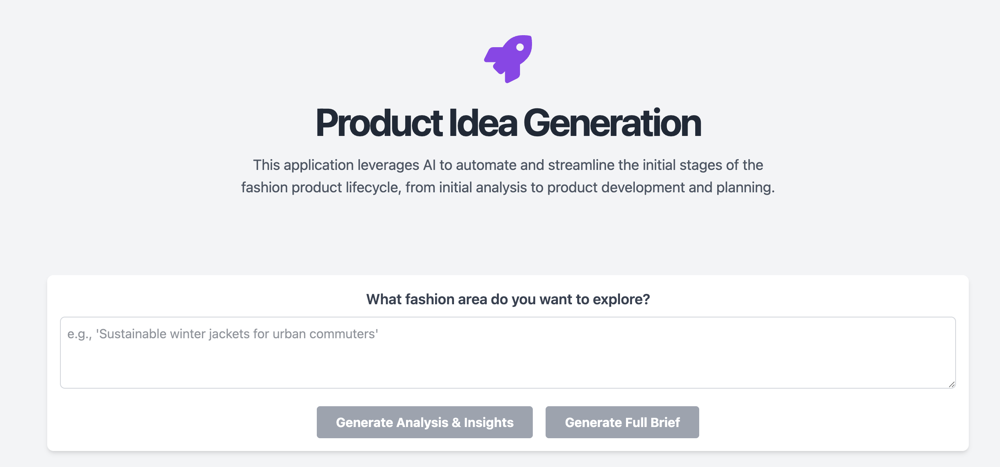

# Production Automation: AI-Powered Fashion Product Development

This is a full-stack web application designed to streamline the fashion product development lifecycle. It uses AI to generate insights, strategies, and content for each stage of the process, from initial analysis to demand planning. The application culminates in a "Digital Brief," a comprehensive summary of the product's journey.



## Features

- **Multi-Stage Workflow:** Guides users through a structured product development process, including stages like Analysis & Insights, Assortment Strategy, Product Ideation, and more.
- **AI-Powered Generation:** Leverages Google's Gemini AI to generate content and data for each stage based on user input and the outputs of previous stages.
- **Dynamic Digital Brief:** Creates a living document that summarizes the entire project, which is updated as each stage is completed.
- **Presentation View:** Offers a visually appealing presentation mode for the digital brief.
- **Image Generation:** Includes a stage for generating product images based on AI-driven concepts.
- **Interactive UI:** A modern, reactive user interface built with Next.js and Tailwind CSS.


## Tech Stack

- **Frontend:**
  - [Next.js](https://nextjs.org/) (React Framework)
  - [TypeScript](https://www.typescriptlang.org/)
  - [Tailwind CSS](https://tailwindcss.com/)
- **Backend:**
  - [Python](https://www.python.org/)
  - [FastAPI](https://fastapi.tiangolo.com/) (Web Framework)
  - [Uvicorn](https.www.uvicorn.org) (ASGI Server)
  - [Google Vertex AI](https://cloud.google.com/vertex-ai) (for Gemini API)

## Prerequisites

Before you begin, ensure you have the following installed:
- [Node.js](https://nodejs.org/en/) (v18 or later) and npm
- [Python](https://www.python.org/downloads/) (v3.9 or later) and pip

You will also need:
- A Google Cloud Platform (GCP) project.
- The Vertex AI API enabled in your GCP project.
- A service account key file (in JSON format) with permissions to use the Vertex AI API.

## Setup and Installation

1.  **Clone the repository:**
    ```bash
    git clone <repository-url>
    cd production_automation
    ```

2.  **Backend Setup:**
    - Navigate to the backend directory:
      ```bash
      cd backend
      ```
    - Place your GCP service account JSON key file in this directory.

    - Create a `.env` file in the `backend` directory by copying the `.env.example` file. Then, fill in the values for your GCP project and the name of your service account key file.
      
      `.env.example`:
      ```
      GOOGLE_CLOUD_PROJECT="your-gcp-project-id-here"
      GOOGLE_APPLICATION_CREDENTIALS="your-service-account-key-file.json"
      ```
      The application uses this file to configure the Google Cloud client.

    - Create and activate a Python virtual environment:
      ```bash
      python3 -m venv venv
      source venv/bin/activate
      # On Windows, use: venv\Scripts\activate
      ```

    - Install the required Python packages:
      ```bash
      pip install -r requirements.txt
      ```

3.  **Frontend Setup:**
    - In a new terminal, navigate to the frontend directory from the project root:
      ```bash
      cd frontend
      ```
    - Install the required npm packages:
      ```bash
      npm install
      ```

## Running the Application Locally

You need to have both the backend and frontend servers running simultaneously.

1.  **Start the Backend Server:**
    - In the terminal where you set up the backend (with the virtual environment activated), run:
      ```bash
      uvicorn main:app --reload
      ```
    - The backend server will be running on `http://localhost:8000`.

2.  **Start the Frontend Server:**
    - In the terminal where you set up the frontend, run:
      ```bash
      npm run dev
      ```
    - The frontend development server will be running on `http://localhost:3000`.

3.  **Access the Application:**
    - Open your web browser and navigate to `http://localhost:3000`.

You should now be able to use the application. 